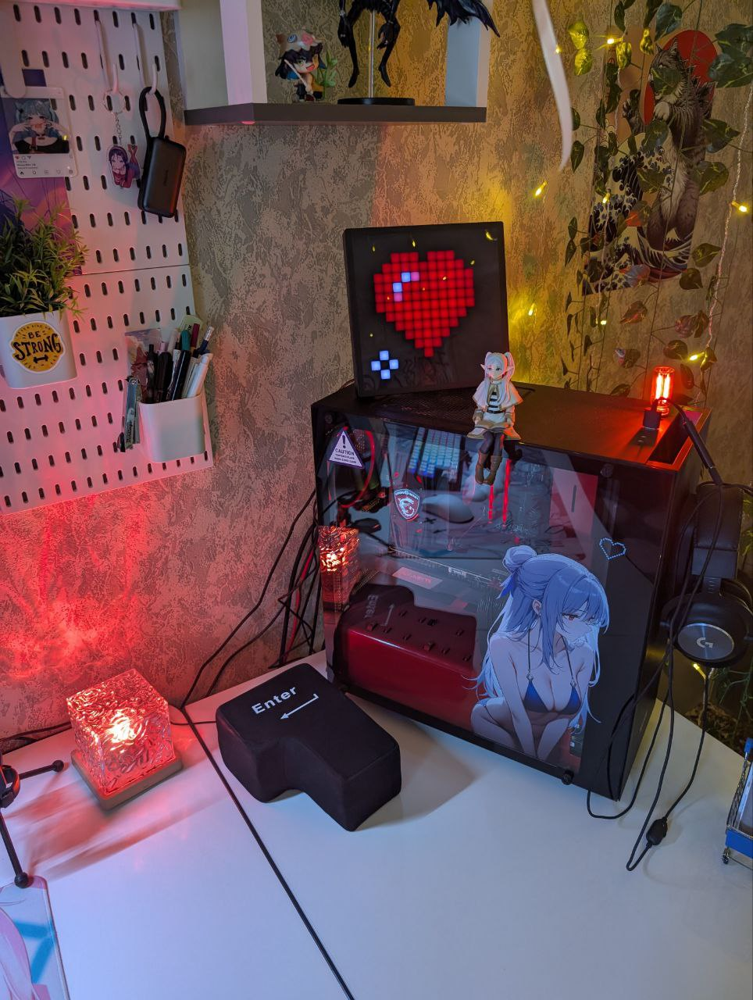

## Привет! 👋 Меня зовут Олег Кравцов

### Сейчас я:
*   🎓 Студент Томского Политехнического Университета по направлению "Электроника и наноэлектроника"
*   💼 Работаю техником в Лаборатории Теплового контроля ИШНКБ ТПУ, где участвую в разработке [приложения](https://github.com/RadioPizza/TPU-TNDT-DualCam-App) для управления дефектоскопом в команде с [Владиславом](https://github.com/Wl4dick) и [Константином](https://github.com/RenderAlien)
*   ✍️ Работаю над дипломным проектом: *"Разработка умного USB-хаба с удалённым управлением портами, поддержкой быстрой зарядки и интеграцией в системы умного дома"*

### У самурая нет цели, есть только путь

Мой путь в электронике и программировании начался с чистого энтузиазма, я никогда не посещал никакие кружки/секции по этим темам.

*   **С 6 класса (2016)** увлекся DIY-электроникой: `Arduino`, `ESP8266`, `схемотехника`, `робототехника`, `пайка`, `слесарные работы`. Постепенно превращал свою комнату в настоящую лабораторию прикладной электроники, изучая всё самостоятельно.
*   **С 9 класса (2019)** начал программировать на `Python` и открыл для себя мир `FDM 3D-печати`. С появлением дома первого 3D-принтера начал изучать параметрическое `3D-моделирование`, начав с `Autodesk Fusion 360`.
*   **С 1 курса (2022)** изучаю `высшую математику`, `ЕСКД`, углубился в САПР: изучал `Autodesk Inventor` и `SolidWorks`.
*   **Со 2 курса (2023)** начал изучать `KiCad`, `Altium Designer`, `цифровую схемотехнику` и [`ПЛИС`](https://github.com/RadioPizza/TPU-Labs-FPGA-basics).
*   **С 3 курса (2024)** перешёл к более сложным микроконтроллерам [`STM8`](https://github.com/RadioPizza/TPU-Labs-Embedded-STM8)/`STM32`, углубился в `аналоговую схемотехнику`, а также поступил на дополнительную специализацию "Разработка мобильных приложений для ОС Android" в ТПУ.

### Коммерческий опыт работы

**Техник** | НИ ТПУ, г. Томск  
*Период: сентябрь 2022 - н.в.*
- Разработка ПО для разрабатываемого промышленного дефектоскопа:
    *   с 2023 по октябрь 2025 работал над проектом **[TPU-TNDT-DualCam-App](https://github.com/RadioPizza/TPU-TNDT-DualCam-App)** в одиночку, полная ответственность за все архитектурные решения
    *   разработка макетов `UI` в `Figma`, составление блок-схем в `draw.io`
    *   выбор стека: `Python`, `PySide6`, `OpenCV`, `NumPy`
    *   разработка GUI с помощью Qt Creator, стилизация с помощью `QSS`
    *   реализация основного функционала
    *   с октября 2025 работаю над этим проектом в команде
- Работа с роботом-манипулятором `KUKA KR 600`
- Улучшение `UX`/`UI` промышленного ПО

---

**Embedded-разработчик** | АО «НПФ «Микран», г. Томск  
*Период: январь 2025 - март 2025*
- Изучение `STM32`, ООП в `C++`
- Разработка драйвера `SPI` на `CMSIS`

---

**Инженер-электронщик** | ООО НПП "Инситек", г. Томск  
*Период: июль 2025 - октябрь 2025*
- Полный цикл самостоятельной разработки устройства на `STM32H723` в паре с [Владиславом](https://github.com/Wl4dick):
    *   Разработка электрических структурных (`Э1`) и принципиальных (`Э3`) схем
    *   Трассировка двух двухслойных печатных плат с плотной компоновкой (`KiCad`)
    *   Грамотная разводка цепей питания и дифференциальных пар
    *   Ручной монтаж SMD-компонентов
    *   Отладка с использованием мультиметра, осциллографа и логического анализатора

### Навыки и компетенции

---

Обожаю писать инструменты, быстро накидывать полезные скрипты, разрабатывать десктопные приложения (`CLI`/`GUI`). Интересна тема автоматизации измерений, контроля и испытаний на профессиональном лабораторном оборудовании. Люблю писать заметки и документацию используя `Markdown`, `LaTeX`, `Obsidian` и `Doxygen`.

---

С удовольствием разрабатываю прошивки для микроконтроллеров (`AVR`, `STM8`, `STM32`, `ESP8266`, `ESP32`, `ARM`, `RISC-V`). В арсенале: `VS Code`, `PlatformIO`, `Arduino IDE`, `ST Visual Develop`, `STM32CubeIDE`, `STM32CubeMX`. В планах — изучить `ESP-IDF`.

---

`Kotlin` использую для разработки под Android, пока на стадии активного обучения: **[TPU-Labs-Android-development](https://github.com/RadioPizza/TPU-Labs-Android-development)**

### Принципы и увлечения

- **Подход к работе:** ценю системный подход, чётко обозначенные задачи, подробное ТЗ, понятный нейминг. Использую `Conventional Commits`.
- **Хобби:** собираю умный дом, смотрю YouTube и аниме, играю в Minecraft и Fortnite (EGS: OlegKravtsov).
- **Мечты:** стать экспертом в своей области, автором на Habr и YouTube.

### Моё оборудование

#### Настольный компьютер

#### Ноутбук

#### Домашная лаборатория

- **Измерительное:**
    *   осциллограф `Hantek 2C10` (перепрошитый в 2D15)
    *   логический анализатор `DreamSourceLab DSLogic Plus` (16 каналов, 400 МГц)
    *   милливольтметр `GW Instek GVT-417B`
    *   мультиметр `UNI-T UT61B`
    *   токовые клещи `UNI-T UT210E`
    *   шумомер `UNI-T UT353`
    *   мультифункциональный тестер компонентов `Fnirsi DSO-TC2`
    *   ИК-пирометр `Xueliee GM320`
- **Источники:**
    *   лабораторный блок питания `Hantek HDP135V6A`
    *   генератор сигналов `UNI-T UTG932E`
- **Паяльное:**
    *   паяльник `Miniware TS101` (90 Вт)
    *   паяльник `Alientek T80` (C210, 100 Вт)
    *   паяльник `Alientek T90B` (C245, 140 Вт)
    *   паяльный фен `JCD 8858` (750 Вт)
- **3D-печать:**
    *   3D-принтер `Creality K1`
    *   3D-принтер `Flying Bear Ghost 4S`
    *   сушилка `eSun eBOX Lite`
- **Прочее:**
    *   лазерный гравер `FlyingBear LaserMan` (5,5 Вт)
    *   дрель-шуруповёрт `Makita DF488DWE`
    *   электрический лобзик `Oasis LE-85`
- У нас было два килограмма резисторов, семьдесят пять микроконтроллеров, пять пачек разных датчиков, пол лотка операционных усилителей и целая галактика конденсаторов всех видов и номиналов, а также литр изопропилового спирта, литр перекиси водорода, ведро лимонной кислоты, пол литра WD-40 и две бутылки бензина. Не то чтобы всё это было нужно для проектов, но если начал собирать лабораторию, остановиться уже невозможно. Единственное, что вызывало у меня опасение — это BGA-корпуса. Нет ничего более беспомощного, обречённого и наивного, чем человек, пытающийся паять BGA в домашних условиях. И я знал, что рано или поздно мы перейдем и на эту дрянь.

### 📫 Как со мной связаться

[][VK]
[][TG]

[VK]: https://vk.com/kravtsov.oleg
[TG]: https://t.me/kravtsov_oleg

### 🏆 Мои достижения на Codewars

### 📈 Статистика GitHub

